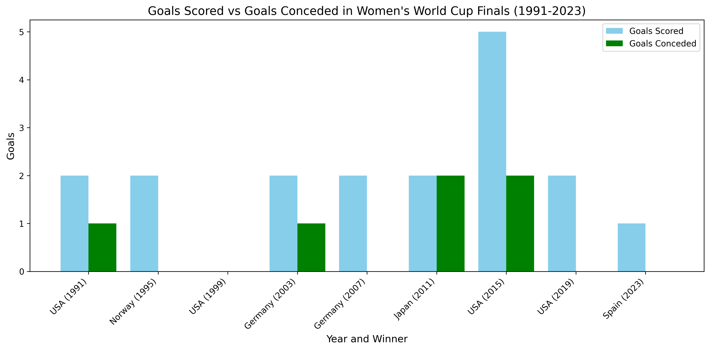

# Data Visualization of the Women's World Cup Final Goals Over the Years

## About
This project visualizes the score of every FIFA - Women's World Cup championship game since its inception in 1991.  

## Data Used
-Year of Each Women's World Cup
-Winning Country
-Goals Scored by the Winning Team in the Championship Game
-Goals Conceded by the Winning Team in the Championship Game

## Visualization Created
I created a grouped bar chart to show the goals scored and conceded by the winning country during the championship game.
-x-axis shows the year and winning country
-y-axis shows the number of goals 
-Blue bar shows goals scored by winning team, green bar shows goals conceded

## A png of the Chart Created

